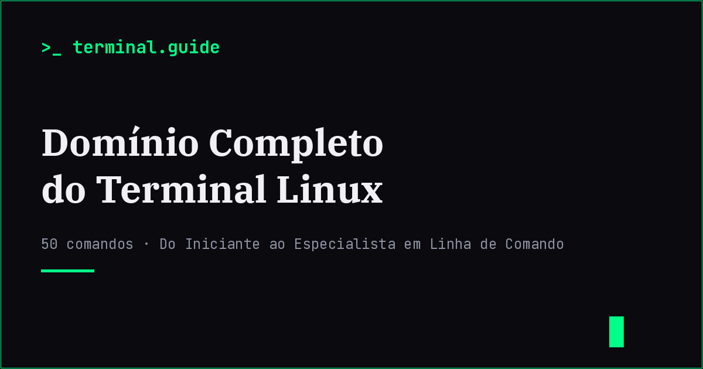

# Domínio Completo do Terminal Linux

> Guia interativo e bilingue (PT/EN) do terminal Linux — 46 comandos e combinações explicados do básico ao avançado, num ficheiro HTML autocontido.

**🔗 Live:** [cxi5.github.io/terminal-guide/](https://cxi5.github.io/terminal-guide/)

## O que é

Um ebook interativo em HTML, CSS e JavaScript (sem frameworks, sem build step) que ensina o terminal Linux a partir do zero. Funciona como um "leitor" de página única: navegação por capítulos, índice lateral, barra de progresso e suporte total a PT/EN.

## Funcionalidades

- 🌐 **Bilingue** — troca instantânea entre Português e Inglês, incluindo os comentários dentro dos blocos de código (confirmado: 221 pares de atributos `data-pt`/`data-en` em todo o `index.html`)
- ;;
- 🌓 **Tema claro/escuro**
- 💾 **Retoma de leitura** — guarda localmente em que página, idioma e tema ficaste, e volta exactamente para lá da próxima vez que abrires o ficheiro
- 🔗 **Links directos por página** — `index.html#page-4` abre já naquela página

## Conteúdo actual

O guia cobre hoje o **Capítulo 1 — Fundamentos de Navegação**, com **46 comandos e combinações** organizados em 6 blocos temáticos:

1. Descobrir Onde Estás
2. Listar e Ver Conteúdo
3. Navegar Estrategicamente
4. Encontrar e Buscar
5. Estrutura e Metadados
6. Combinações Avançadas (3 padrões: `find + grep`, `ls` + wildcards, `cd + ls`)

Novos capítulos serão adicionados progressivamente.

## Licença

O **código** (HTML/CSS/JS) está sob licença MIT — ver [LICENSE](LICENSE).

O **texto e conteúdo do ebook** (explicações, exemplos, biografia do autor) pertence a Leonardo Sebastião. Podes partilhar e citar com atribuição, mas não redistribuir ou vender como teu.

## Autor

**Leonardo Sebastião** — entusiasta e estudante de tecnologia.

Se este guia te ajudou, podes apoiar o trabalho em [Ko-fi](https://ko-fi.com/cxi50) ou seguir o projecto no [GitHub](https://github.com/cxi5).
